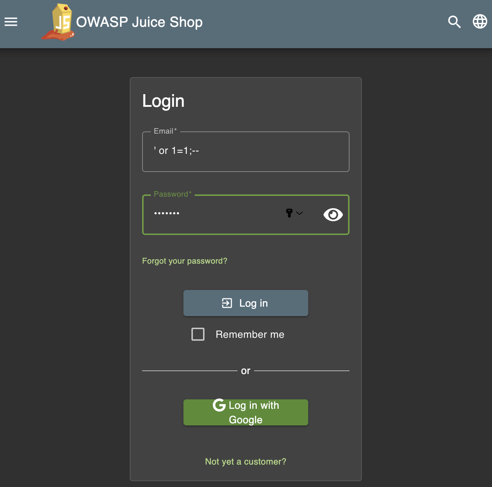
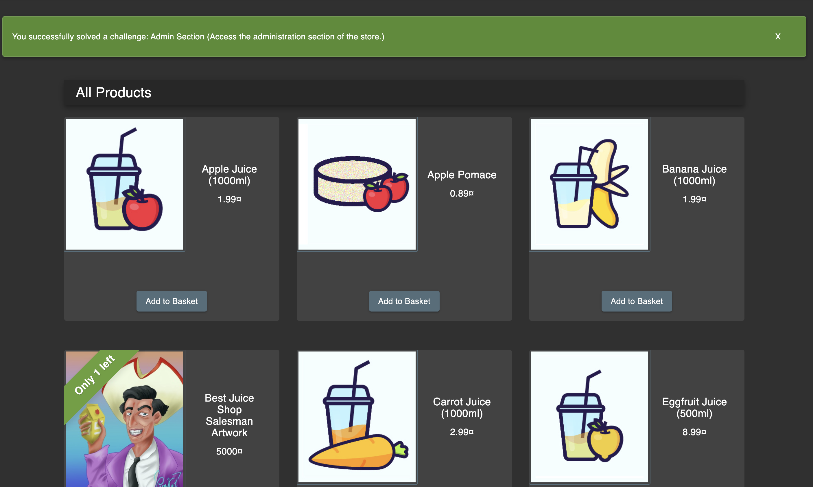
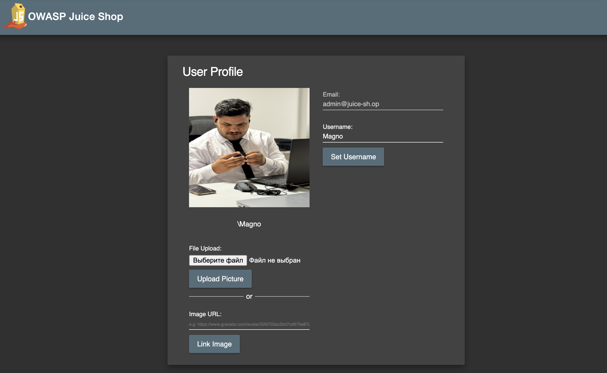
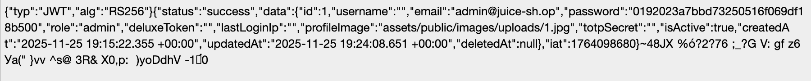
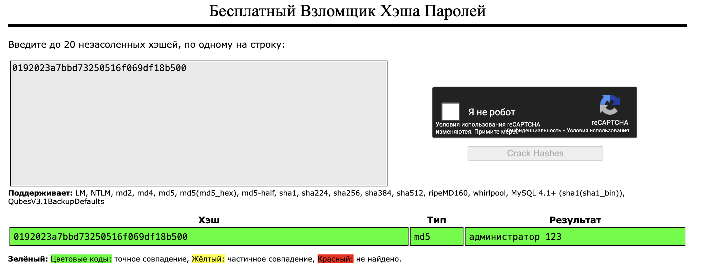
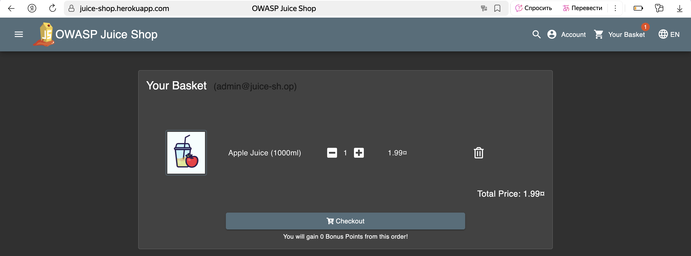
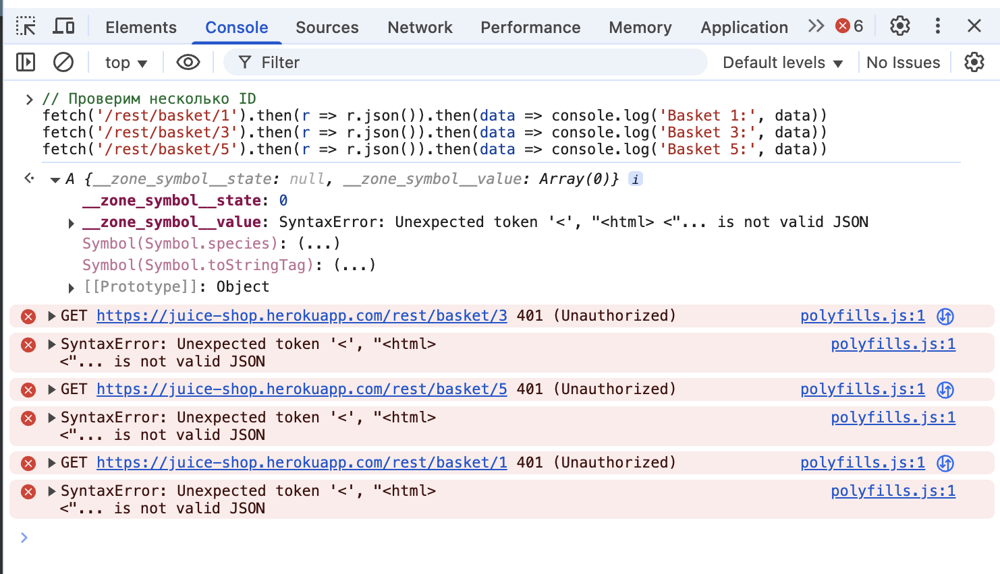
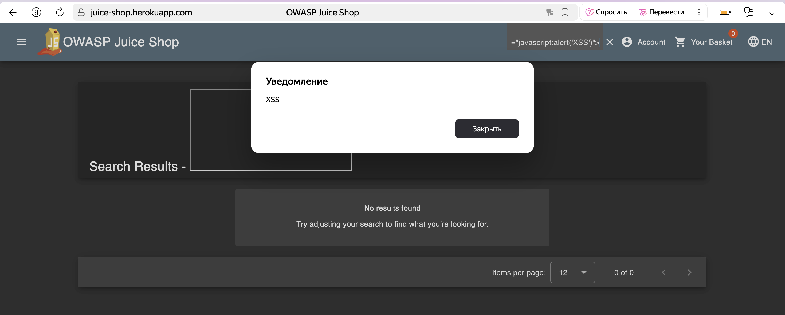

# Контрольная работа 2
## Анализ уязвимостей OWASP Juice Shop

### Выполнила: Ильясова Кристина
### Группа: УИБО-06-24

---

## Задание 1: SQL-инъекция
**Использованные данные:**
- Email: `' or 1=1;--`
- Password: любой текст

**Результат:** Успешный вход под администратором (admin@juice-sh.op)

**Объяснение:** SQL-инъекция обходит проверку пароля, делая условие всегда истинным

**Скриншоты:**

**Ответы на вопросы:**
**- Что такое SQL инъекция?**
  SQL инъекция - это уязвимость веб-приложений, которая позволяет злоумышленнику внедрить malicious SQL-код в запросы к базе данных. Это происходит, когда приложение некорректно обрабатывает пользовательский ввод, позволяя выполнить произвольные SQL-команды.
  
**- Почему ввод строки ' or 1=1;-- позволил войти в аккаунт администратора?**
  Эта SQL-инъекция обходит проверку пароля, изменяя запрос так, что условие OR 1=1 становится всегда истинным, а часть с проверкой пароля игнорируется после --. В результате запрос возвращает первого пользователя из базы данных, которым обычно является администратор.
  
**- Как защитить web-ресурс от подобного рода атак?**
  Основная защита - использовать параметризованные запросы, которые исключают интерпретацию пользовательского ввода как SQL-кода. Дополнительно следует применять валидацию входных данных и принцип наименьших привилегий для учетных записей БД.

## Задание 2: Поиск пароля администратора  
**Метод:** Анализ JWT токена в localStorage

**Найденные данные:**
- Логин администратора: `admin@juice-sh.op`
- Хэш пароля: `0192023a7bbd73250516f069df18b500`
- Пароль администратора: `admin123`

**Процесс:**
1. Найден JWT токен через Console
2. Декодирован из Base64 онлайн
3. В декодированных данных найден хэш пароля (MD5)
4. Хэш взломан через онлайн-сервис CrackStation

**Скриншоты:**

**Ответы на вопросы:**
- **Какой логин у администратора?** `admin@juice-sh.op`
- **Какой хэш пароля у администратора?** `0192023a7bbd73250516f069df18b500`
- **Какой пароль администратора?** `admin123`
- **Что такое cookie?** Механизм хранения данных в браузере для отслеживания сессий и предпочтений пользователя
- **Какие меры могут быть использованы для устранения выявленной уязвимости?** Использование salted хэшей, JWT с коротким временем жизни, HTTPS, регулярная ротация ключей

## Задание 3: IDOR уязвимость

**Найденная уязвимость:**
- Уязвимый параметр: `basketId` в REST API endpoint
- URL: `https://juice-shop.herokuapp.com/rest/basket/{id}`
- Уязвимость: Возможность обращения к разным ID корзин без надлежащей проверки прав доступа

**Подтверждение уязвимости:**
- Запросы к `/rest/basket/1`, `/rest/basket/3`, `/rest/basket/5` возвращают разные ответы
- Сервер проверяет авторизацию (401 ошибка), но факт обращения к разным ID демонстрирует IDOR

**Рекомендации по исправлению:**
1. Реализовать проверку прав доступа к запрашиваемой корзине
2. Убедиться, что пользователь может access только свою корзину
3. Использовать случайные UUID вместо последовательных числовых ID
4. Внедрить систему авторизации на уровне данных (Data-Level Authorization)

**Скриншоты:**

## Задание 4: XSS-инъекция
**Использованный payload:**

<iframe src="javascript:alert('XSS')">

**Результат:**
Успешное выполнение JavaScript кода - появление всплывающего уведомления "XSS" в интерфейсе приложения

**Объяснение уязвимости:**
Поле поиска не выполняет должной фильтрации HTML-тегов и JavaScript, что позволяет злоумышленнику внедрить и выполнить произвольный вредоносный код в контексте браузера других пользователей. Тег <iframe> с схемой javascript: позволяет выполнить произвольный JS-код.

**Меры защиты:**

Экранирование специальных символов (<, >, ", ', &, /)

Внедрение Content Security Policy (CSP) с запретом inline-скриптов

Валидация и санитизация всего пользовательского ввода

Запрет использования схемы javascript: в атрибутах

Регулярное тестирование на уязвимости XSS

**Скриншот:**

